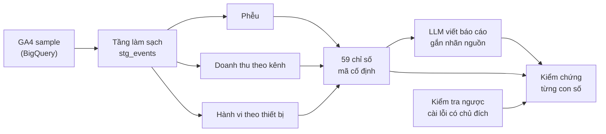

# Báo cáo AI có kiểm chứng: làm sao tin được con số do LLM viết ra?

## Tóm tắt

LLM viết báo cáo phân tích rất trôi chảy, nhưng có thể chép sai hoặc bịa số liệu, và người đọc gần như không có cách nào phát hiện. Dự án này xây một pipeline phân tích dữ liệu e-commerce (Google Analytics 4), cho LLM viết báo cáo insight từ kết quả phân tích, rồi **kiểm chứng tự động từng con số** trong báo cáo với dữ liệu gốc.

Kết quả: trong 3 báo cáo sinh tự động, **160/160 con số được xác minh đúng theo đúng chỉ số mà nó mô tả**. Để chứng minh kết quả này không đến từ một công cụ kiểm chứng "luôn báo đúng",các bước thực hiện có cài 4 loại lỗi vào một báo cáo đúng: công cụ phát hiện **4/4**.

---

## 1. Vấn đề

Doanh nghiệp ngày càng muốn dùng AI để tự động viết báo cáo từ dữ liệu. Rủi ro lớn nhất không phải là văn phong, mà là **số liệu sai trông như số liệu đúng**: một tỷ lệ chuyển đổi bị chép nhầm, một con số được gán cho nhầm kênh, hay một phép tính LLM tự làm mà không ai kiểm tra. Trong báo cáo kinh doanh, một con số sai có thể dẫn đến quyết định sai.

Câu hỏi của dự án: **làm sao đo được độ tin cậy của một báo cáo do AI viết, thay vì chỉ đọc lướt và cảm thấy nó đúng?**

## 2. Ý tưởng cốt lõi

Tách việc **tính toán** khỏi việc **diễn giải**, và biến mọi con số thành thứ kiểm tra được:

1. **LLM không được tính toán.** Mọi con số được tính trước bởi một pipeline SQL có test tự động. LLM chỉ nhận các con số đã tính sẵn và viết thành văn.
2. **Mỗi con số phải khai nguồn.** LLM bắt buộc gắn nhãn chỉ số ngay sau mỗi con số, ví dụ `6.53% [funnel.rate_view_to_purchase]`. Nhãn được xóa trước khi đưa báo cáo cho người đọc.
3. **Kiểm chứng tự động theo đúng đối tượng.** Mỗi con số được so với giá trị thật của **chính chỉ số trong nhãn**, không phải với bất kỳ giá trị nào trùng khớp.
4. **Kiểm chứng chính công cụ kiểm chứng.** Cài lỗi có chủ đích để chứng minh công cụ thực sự bắt được lỗi.

## 3. Cách thực hiện

### Bước 1: Hiểu dữ liệu trước khi xây dựng

Dữ liệu là dataset GA4 mẫu công khai của Google Merchandise Store (01/11/2020 – 31/01/2021; khoảng 4,3 triệu event, 270 nghìn user), **đã bị làm mờ** một phần. Trước khi viết pipeline, tôi dành một ngày khám phá dữ liệu bằng SQL, và phát hiện nhiều vấn đề nếu bỏ qua sẽ làm sai kết luận:

- **Sự kiện "thêm vào giỏ" không được ghi nhận trong 3 tuần đầu**, trong khi đơn hàng vẫn phát sinh hằng ngày. Nếu dùng nguyên dữ liệu, phễu chuyển đổi sẽ cho thấy khách "mua mà không thêm giỏ". → Phân tích phễu chỉ dùng giai đoạn sau khi tracking ổn định.
- **Đơn hàng bị ghi trùng** khi khách tải lại trang xác nhận (cùng mã giao dịch, cùng số tiền). → Loại trùng, giữ bản ghi đầu tiên.
- **15.9% sự kiện mua hàng mang mã giao dịch bị làm mờ**, chiếm 8.8% doanh thu, không thể loại trùng. → Loại khỏi chỉ số doanh thu (sai số đo được) nhưng vẫn tính là "có mua" trong phễu (vì khách thực sự đã mua).
- **Nguồn truy cập "lần đầu" của 15.6% user lại thay đổi** giữa các event, trái với định nghĩa. → Quy tắc: lấy nguồn của event sớm nhất.

Mỗi phát hiện được kiểm chứng bằng query cụ thể và ghi lại cùng cách xử lý.

### Bước 2: Pipeline dữ liệu có test

Xây bằng **dbt** trên **BigQuery**, gồm hai tầng:

- **Tầng làm sạch dùng chung:** làm phẳng dữ liệu lồng nhau, chuẩn hóa kiểu dữ liệu, và **gắn cờ** các vấn đề chất lượng thay vì xóa. Mỗi bảng phân tích phía sau tự quyết định lọc hay giữ, vì cùng một bản ghi có thể hợp lệ cho câu hỏi này nhưng không hợp lệ cho câu hỏi khác.
- **Ba bảng phân tích** cho ba câu hỏi kinh doanh: phễu chuyển đổi, doanh thu theo kênh, hành vi theo thiết bị.

### Bước 3: LLM viết báo cáo

Kết quả của ba bảng được chuyển thành **59 chỉ số, mỗi chỉ số có một mã cố định**, rồi gửi cho Gemini. Prompt được thiết kế **để phục vụ việc kiểm chứng**, không chỉ để văn hay:

- Output ép theo cấu trúc JSON để luôn đọc được bằng code.
- Cấm tự tính số mới (cộng, trừ, lấy chênh lệch), vì số tự tính không truy về được nguồn.
- Quy định định dạng số (không dấu phân cách hàng nghìn, làm tròn 2 chữ số) để công cụ kiểm chứng nhận diện chính xác.
- Đưa các phát hiện chất lượng dữ liệu vào prompt, để báo cáo nêu đúng các lưu ý, và không diễn giải chênh lệch rất nhỏ thành "khác biệt rõ rệt".

### Bước 4: Kiểm chứng tự động, và tự tìm điểm yếu của chính mình

Giải quyết bằng nhãn nguồn: mỗi con số được kiểm tra với đúng chỉ số mà nó tự nhận là. Con số không có nhãn được tách riêng thành hai loại: "có trong dữ liệu nhưng thiếu nhãn" (lỗi tuân thủ) và "không truy vết được" (dấu hiệu bịa số).

Hai quyết định thiết kế đáng chú ý:
- **Sai số cho phép là 0.0051**, đúng bằng sai số tối đa khi làm tròn 2 chữ số thập phân. Kế hoạch ban đầu là ±1%, nhưng mức này quá lỏng với số đếm: 1% của 55502 phiên là 555 phiên.
- **Không so sánh bằng tuyệt đối**, vì BigQuery tính toán song song nên cùng một chỉ số có thể lệch ở chữ số thập phân thứ 13–14 giữa các lần chạy.

Cuối cùng, **kiểm tra ngược (negative control)**: lấy một báo cáo đã đúng 100%, lần lượt cài 4 loại lỗi (sai giá trị, nhãn không tồn tại, số bịa không nhãn, thiếu nhãn), và xác nhận công cụ phát hiện từng loại.

## 4. Kết quả

### Độ tin cậy của báo cáo AI

Model `gemini-3.5-flash`, cùng một bộ số liệu và cùng một prompt:

| Chỉ số | Kết quả |
|---|---|
| Số lần model trả về phản hồi | 4 |
| Báo cáo đọc được | 3 |
| Phản hồi không đúng cấu trúc | 1 |
| Tổng số con số trong 3 báo cáo | 160 (61, 50, 49) |
| **Xác minh đúng theo đúng chỉ số được gắn nhãn** | **160/160** |
| Sai giá trị / nhãn không tồn tại / không truy vết được | 0 / 0 / 0 |
| Kiểm tra ngược: số loại lỗi được phát hiện | **4/4** |

Hai quan sát ngoài con số chính:
- **1 trong 4 phản hồi không đúng cấu trúc**, cho thấy độ tin cậy của LLM không chỉ là chuyện số đúng hay sai; một hệ thống thật cần xử lý cả trường hợp model trả về output hỏng.
- **Mỗi báo cáo nhắc đến số lượng con số khác nhau** (49 đến 61) dù cùng đầu vào: output của LLM không tất định, nên đo một lần là chưa đủ.

### Insight kinh doanh

- **Phễu chuyển đổi:** 6.53% phiên xem sản phẩm dẫn đến mua hàng. Đây là chỉ số ổn định nhất của phễu, vì không phụ thuộc vào sự kiện "thêm vào giỏ" vốn bị thiếu dữ liệu (24.1% phiên mua hàng không ghi nhận bước này).
- **Doanh thu theo kênh:** tìm kiếm tự nhiên (organic) đóng góp 34.77% doanh thu, truy cập trực tiếp 23.25%. Thứ hạng doanh thu đi theo quy mô user của kênh; **tỷ lệ chuyển đổi giữa các kênh chỉ dao động 1.27%–1.51%**, nên không kết luận kênh nào chuyển đổi tốt hơn rõ rệt. 20.86% doanh thu không xác định được kênh do dữ liệu bị làm mờ.
- **Hành vi theo thiết bị:** desktop, mobile và tablet gần như giống nhau về số trang mỗi phiên (3.67–3.76), thời gian tương tác (65–71 giây) và tỷ lệ chuyển đổi (1.30%–1.39%). "Không có khác biệt đáng kể" cũng là một kết luận, và báo cáo trung thực phải nói đúng như vậy.

## 5. Bài học rút ra

- **Một kết quả 100% chưa chứng minh được gì nếu chưa chứng minh công cụ đo hoạt động.** Kiểm tra ngược là phần biến con số 160/160 thành bằng chứng.
- **Giới hạn của công cụ quan trọng ngang kết quả của nó.** Phát hiện lỗ hổng "1.32%" ở phiên bản đầu dẫn đến thay đổi lớn nhất của dự án.
- **Chất lượng dữ liệu quyết định kết luận nhiều hơn mô hình.** Nếu không phát hiện lỗi tracking và đơn hàng trùng ở bước khám phá, cả pipeline lẫn báo cáo AI đều sẽ chính xác một cách hoàn hảo, nhưng trên số liệu sai.
- **Thiết kế prompt cho máy kiểm tra, không chỉ cho người đọc.** Các quy tắc định dạng tồn tại vì công cụ kiểm chứng cần chúng.

## 6. Hạn chế và hướng phát triển

**Hạn chế:**
- Công cụ kiểm tra "con số khớp với nhãn", nhưng chưa kiểm tra "nhãn khớp với chữ trong câu", và không phát hiện diễn giải sai khi con số đúng (ví dụ gọi chênh lệch nhỏ là "vượt trội").
- Mẫu đo nhỏ: 3 báo cáo, một model, một phiên bản prompt. "Không phát hiện lỗi trong 160 con số" không có nghĩa model không bao giờ sai.
- Dữ liệu mẫu đã bị làm mờ, chưa có kiểm định thống kê cho các so sánh, pipeline chưa chạy tự động theo lịch.

**Hướng phát triển:**
- **Chạy theo lịch** (GitHub Actions) để theo dõi độ tin cậy của LLM theo thời gian, vì output không tất định và model phía nhà cung cấp có thể thay đổi.
- **So sánh nhiều model và phiên bản prompt** trên cùng bộ số liệu.
- **Kiểm chứng diễn giải** bằng một LLM khác đóng vai người chấm.
- **Áp dụng cho dữ liệu GA4 thật**: chỉ cần đổi khai báo nguồn dữ liệu.

---

## Phụ lục

### Kiến trúc

| Thành phần | Công cụ |
|---|---|
| Warehouse | BigQuery |
| Transform và test | dbt |
| Ngôn ngữ | SQL, Python |
| LLM | Gemini API |

### Tài liệu chi tiết

- [`docs/architecture.md`](docs/architecture.md): kiến trúc từng tầng.
- [`docs/data_exploration.md`](docs/data_exploration.md): toàn bộ quá trình khám phá dữ liệu và các quyết định xử lý.
- [`docs/how_to_run.md`](docs/how_to_run.md): hướng dẫn cài đặt và chạy lại pipeline.
- `sql/exploration/`: các query khám phá dữ liệu.
- `outputs/`: báo cáo do LLM sinh ra và kết quả kiểm chứng.
